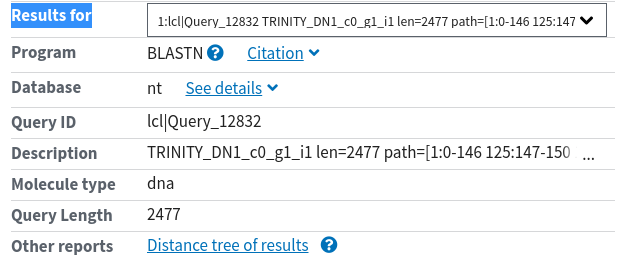

## SPP workshop - *de novo* transcriptome assembly
###  October 2019 | MPIPZ Cologne

<!-- content start -->

- [1. Prerequisites](#1-prerequisites)
- [2. De novo assembly](#2-de-novo-assembly)
- [3. Practice](#4-practice)
- [References](#references)
    
<!-- content end -->

## 1. Prerequisites

1. We will use a small set of two pair-end RNA-Seq samples for *de novo* transcriptome assembly. RNA-Seq reads come from *[FLS2](https://www.genome.jp/dbget-bin/www_bget?ath:AT5G46330)* and *[MEKK1](https://www.genome.jp/dbget-bin/www_bget?ath:AT4G08500)*.

```
├── Col0_p_rep1_select_R1.fq.gz
├── Col0_p_rep1_select_R2.fq.gz
├── flg22_p_rep1_select_R1.fq.gz
└── flg22_p_rep1_select_R2.fq.gz
```

2. Scripts

Copy the scripts we need for visualization through `ssh`:

```bash
cp /netscratch/common/MPIPZ_SPP_workshop/RNA-Seq/RNA-Seq_scripts/workshop_denovo* ~
```

## 2. De novo assembly 


## 3. Practice

1. Run the novo assembly through `ssh`:

```bash
## It may take 5 min
bash ~/workshop_denovo_assembly.sh
```

2. View assembled transcripts though `ssh`:

```bash
cat ~/trinity_assembly_select/Trinity.fasta
```

3. Try to [BLAST](https://blast.ncbi.nlm.nih.gov/Blast.cgi?PROGRAM=blastn&PAGE_TYPE=BlastSearch&LINK_LOC=blasthome) and identify our assembled transcripts. Fill `Arabidopsis thaliana (taxid:3702)` in `Organism` to accelerate the process. On the result page, click pull-down menu `Results for` to select transcripts. 



## References

* Castrillo G\*, Teixeira PJ\*, Paredes SH\*, Law TF, de Lorenzo L, Feltcher ME, Finkel OM, Breakfield NW, Mieczkowski P, Jones CD, Paz-Ares J, Dangl JL. **Root microbiota drive direct integration of phosphate stress and immunity.** *Nature* 2017;543(7646):513-518. Single-end data RNA-Seq data.

* Grabherr MG\*, Haas BJ\*, Yassour M\*, Levin JZ, Thompson DA, Amit I, Adiconis X, Fan L, Raychowdhury R, Zeng Q, Chen Z, Mauceli E, Hacohen N, Gnirke A, Rhind N, di Palma F, Birren BW, Nusbaum C, Lindblad-Toh K, Friedman N, Regev A. **Full-length transcriptome assembly from RNA-Seq data without a reference genome.** *Nat Biotechnol*. 2011;29(7):644-52. 

* Hölzer M\*, Marz M. **De novo transcriptome assembly: A comprehensive cross-species comparison of short-read RNA-Seq assemblers.** *Gigascience* 2019;8(5).

