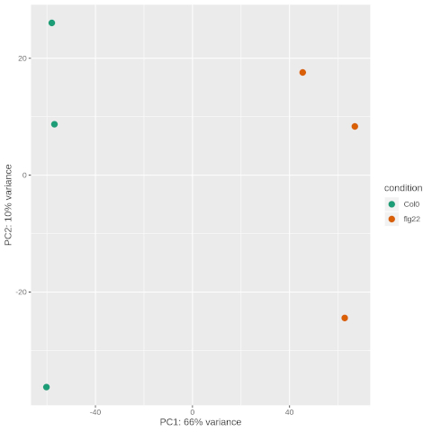
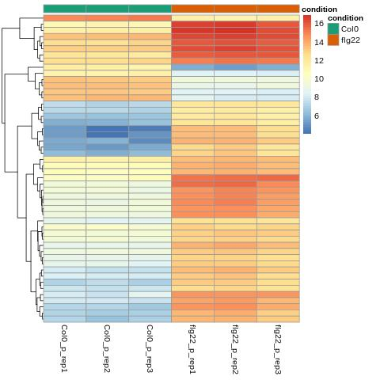

## SPP workshop - Expression data visualization in R
###  October 2019 | MPIPZ Cologne

<!-- content start -->

- [1. Prerequisites](#1-prerequisites)
- [2. Visualization](#2-visualization)
    - [2.1 PCA plot](#21-pca-plot)
    - [2.2 Heatmap](#22-heatmap)
    - [2.3 Run visualization](#23-run-visualization)
- [3. Practice](#3-practice)
- [References](#references)
    
<!-- content end -->

## 1. Prerequisites

1. Alignment results

We will use the whole pair-end alignments by kallisto for demonstration and single-end alignments by kallisto for practice. 

> pair-end alignments by kallisto

```bash
├── Col0_p_rep1_ath_kallisto
├── Col0_p_rep2_ath_kallisto
├── Col0_p_rep3_ath_kallisto
├── flg22_p_rep1_ath_kallisto
├── flg22_p_rep2_ath_kallisto
├── flg22_p_rep3_ath_kallisto
```

> single-end alignments by kallisto

```bash
├── Col0_s_rep1_ath_kallisto
├── Col0_s_rep2_ath_kallisto
├── Col0_s_rep3_ath_kallisto
├── flg22_s_rep1_ath_kallisto
├── flg22_s_rep2_ath_kallisto
├── flg22_s_rep3_ath_kallisto
├── MeJA_s_rep1_ath_kallisto
├── MeJA_s_rep2_ath_kallisto
└── MeJA_s_rep3_ath_kallisto
```

2. Scripts

Copy the scripts we need for visualization through `ssh`:

```
cp /netscratch/common/MPIPZ_SPP_workshop/RNA-Seq/RNA-Seq_scripts/workshop_visual* ~
```

## 2. Visualization

### 2.1 PCA plot 

PCA (principal component analysis) plot shows the samples in the 2D plane spanned by their first two principal components (PC1 and PC2). It is useful for visualizing the variation among RNA-Seq samples with many conditions and possible batch effects.

The following scripts shows how to calculate PC1 and PC2:

```R
## do not run the codes below！！
## 'rld' is the log2 scale counts.
## 'prcomp()' performs a principal components analysis.
pca <- rld %>%
  assay %>%
  t %>%
  prcomp
percentVar <- pca$sdev^2 %>%
  {./sum(.)} %>%
  {100 * .} %>%
  round
pca1 <- pca$x[,1]
pca2 <- pca$x[,2]
pcaData <- data.frame(PC1 = pca1, PC2 = pca2, condition = colData(rld)[, 1], ID = rownames(colData(rld)))
```

The PCA plots of pair-end RNA-Seq data looks like:



### 2.2 Heatmap

Heatmap provides constructive overview of reads count, and it is often used to explore certain expression patterns of differentially expressed genes (DEGs).

The following codes shows how to plot heatmap:

```R
## do not run the codes below！！
## 'ntd' is the normalized counts.
## 'pheatmap()' plots heatmap.
heatmapData <- degres %>%
  rownames %>%
  match(res$ID[1:50], .) %>%
  assay(ntd)[., ]

df <- colData(degres) %>% as.data.frame
heatmapPlot <- pheatmap(heatmapData,
                        cluster_rows = TRUE,
                        show_rownames = FALSE,
                        cluster_cols = FALSE,
                        annotation_col = df,
                        annotation_colors = list(condition = c(Col0 = '#1B9E77', flg22 = '#D95F02')))
```

The heatmap (top 50 DEGs) of pair-end RNA-Seq data looks like:



### 2.3 Run visualization

1. Generated PCA plot and heatmap pair-end through `ssh`:

```bash
/netscratch/common/MPIPZ_SPP_workshop/software/R-3.6.1/bin/Rscript \
~/workshop_visual_pairend.R
```

## 3. Practice


```bash
/netscratch/common/MPIPZ_SPP_workshop/software/R-3.6.1/bin/Rscript \
~/workshop_visual_singleend_answer.R
```

## References

* Love MI, Huber W, Anders S. **Moderated estimation of fold change and dispersion for RNA-seq data with DESeq2.** *Genome Biol.* 2014;15(12):550.

* Castrillo G\*, Teixeira PJ\*, Paredes SH\*, Law TF, de Lorenzo L, Feltcher ME, Finkel OM, Breakfield NW, Mieczkowski P, Jones CD, Paz-Ares J, Dangl JL. **Root microbiota drive direct integration of phosphate stress and immunity.** *Nature* 2017;543(7646):513-518. Single-end data RNA-Seq data.

* Völz R\*, Kim SK, Mi J, Rawat AA, Veluchamy A, Mariappan KG, Rayapuram N, Daviere JM, Achard P, Blilou I, Al-Babili S, Benhamed M, Hirt H\*. **INDETERMINATE-DOMAIN 4 (IDD4) coordinates immune responses with plant-growth in Arabidopsis thaliana.** PLoS Pathog. 2019;15(1):e1007499. Pair-end RNA-Seq data.

